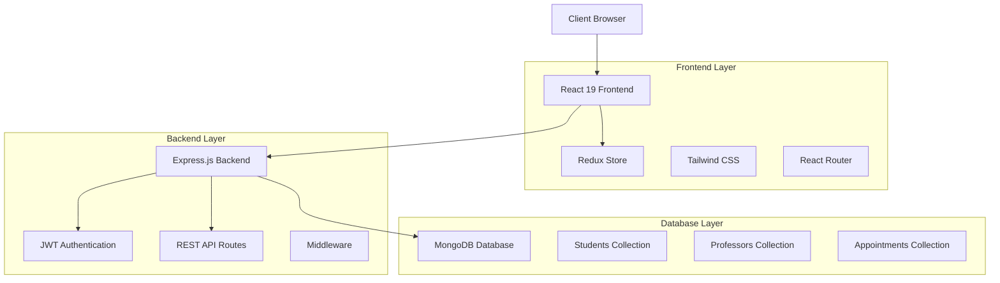
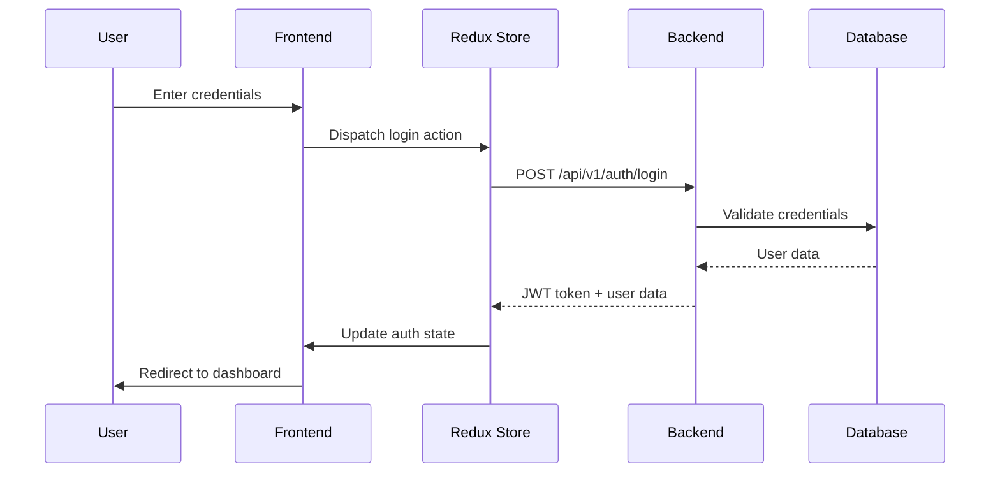
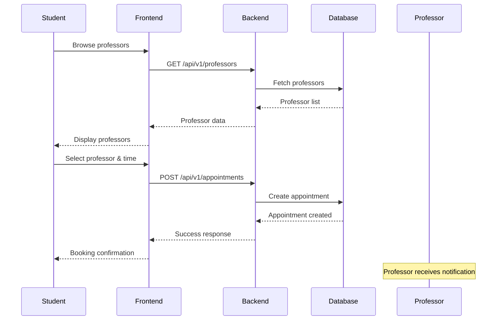
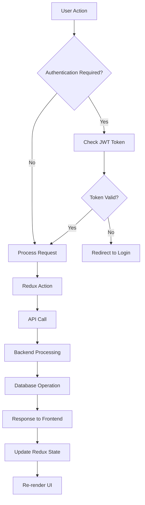
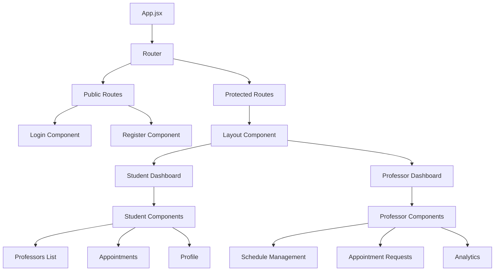

# 🎓 College Appointment System

A modern, full-stack web application for managing appointments between students and professors, built with React 19, Node.js, Express, and MongoDB.

[](https://choosealicense.com/licenses/mit/)
[](https://nodejs.org/)
[](https://reactjs.org/)
[](https://mongodb.com/)

## 📋 Table of Contents

- [Overview](#overview)
- [Architecture](#architecture)
- [Features](#features)
- [Technology Stack](#technology-stack)
- [System Flow Diagrams](#system-flow-diagrams)
- [Project Structure](#project-structure)
- [Installation & Setup](#installation--setup)
- [API Documentation](#api-documentation)
- [Usage Guide](#usage-guide)
- [Development Guide](#development-guide)
- [Contributing](#contributing)
- [License](#license)

## 🎯 Overview

The College Appointment System is a comprehensive solution designed to streamline the appointment booking process between students and professors. It provides role-based access control, real-time notifications, and an intuitive interface for managing academic consultations.

### Key Benefits
- 📅 **Streamlined Scheduling**: Easy appointment booking and management
- 👥 **Role-Based Access**: Separate interfaces for students and professors
- 🔒 **Secure Authentication**: JWT-based authentication with Redux state management
- 📱 **Responsive Design**: Works seamlessly on desktop and mobile devices
- ⚡ **Real-Time Updates**: Live notifications and status updates

## 🏗️ Architecture



### System Architecture Overview

| Layer | Technology | Purpose |
|-------|------------|---------|
| **Frontend** | React 19 + Vite | User interface and client-side logic |
| **State Management** | Redux Toolkit | Centralized state management |
| **Styling** | Tailwind CSS | Responsive and modern UI design |
| **Backend** | Node.js + Express | Server-side logic and API endpoints |
| **Authentication** | JWT + bcryptjs | Secure user authentication |
| **Database** | MongoDB + Mongoose | Data persistence and management |

## ✨ Features

### 👨‍🎓 Student Features
- ✅ Register and login with role-based authentication
- ✅ View available professors and their specializations
- ✅ Book appointments with preferred time slots
- ✅ View and manage upcoming appointments
- ✅ Update comprehensive profile information (contact details, academic info, emergency contacts)
- ✅ Dashboard with appointment statistics and quick actions
- ✅ Receive appointment confirmations and status updates
- ✅ Enhanced error handling with detailed feedback

### 👨‍🏫 Professor Features
- ✅ Register and login with professor credentials
- ✅ Set available time slots and working hours
- ✅ View and manage student appointment requests
- ✅ Accept or decline appointment requests
- ✅ Update extensive profile information (office location, specializations, experience)
- ✅ Dashboard with appointment analytics and insights
- ✅ Schedule management with availability settings
- ✅ Professional profile with qualifications and bio

### 🔧 System Features
- ✅ Role-based access control with JWT authentication
- ✅ Real-time data synchronization and auto-refresh dashboards
- ✅ Responsive design for all devices
- ✅ Professional dark-themed footer with social links
- ✅ Enhanced error handling and user feedback
- ✅ Modern UI/UX with Tailwind CSS styling
- ✅ API documentation with Swagger integration
- ✅ Custom hooks for dashboard refresh functionality

## 🛠️ Technology Stack

### Frontend
```json
{
  "framework": "React 19",
  "build_tool": "Vite",
  "state_management": "Redux Toolkit",
  "routing": "React Router DOM",
  "styling": "Tailwind CSS",
  "forms": "React Hook Form",
  "notifications": "React Hot Toast",
  "http_client": "Axios"
}
```

### Backend
```json
{
  "runtime": "Node.js 18+",
  "framework": "Express.js",
  "database": "MongoDB with Mongoose",
  "authentication": "JWT + bcryptjs",
  "validation": "express-validator",
  "security": "Helmet, CORS, XSS protection",
  "documentation": "Swagger/OpenAPI"
}
```

## 📊 System Flow Diagrams

### 1. Authentication Flow



### 2. Appointment Booking Flow



### 3. Application Data Flow



### 4. Component Architecture



## 📁 Project Structure

```
College-Appointment-System/
├── 📁 backend/                          # Backend API server
│   ├── 📄 app.js                       # Express application entry point
│   ├── 📄 package.json                 # Backend dependencies
│   ├── 📄 README.md                    # Backend documentation
│   ├── 📄 swagger.yaml                 # API documentation
│   ├── 📁 controllers/                 # Request handlers
│   │   ├── auth.js                     # Authentication logic
│   │   ├── professor.js                # Professor-related operations
│   │   └── student.js                  # Student-related operations
│   ├── 📁 db/                         # Database configuration
│   │   └── connect.js                  # MongoDB connection
│   ├── 📁 errors/                     # Custom error handlers
│   │   ├── badRequest.js
│   │   ├── customError.js
│   │   ├── index.js
│   │   ├── notFound.js
│   │   └── unauthenticated.js
│   ├── 📁 middlewares/                # Express middlewares
│   │   ├── authentication.js          # JWT verification
│   │   └── notFound.js                # 404 handler
│   ├── 📁 models/                     # MongoDB schemas
│   │   ├── Appointment.js             # Appointment model
│   │   ├── Professor.js               # Professor model
│   │   └── Student.js                 # Student model
│   ├── 📁 public/                     # Static files
│   │   ├── favicon.ico
│   │   └── home.html
│   └── 📁 routes/                     # API route definitions
│       ├── auth.js                    # Authentication routes
│       ├── professor.js               # Professor routes
│       └── student.js                 # Student routes
│
├── 📁 frontend/                        # React frontend application
│   ├── 📄 index.html                  # HTML template
│   ├── 📄 package.json                # Frontend dependencies
│   ├── 📄 vite.config.js              # Vite configuration
│   ├── 📄 tailwind.config.js          # Tailwind CSS config
│   ├── 📄 postcss.config.js           # PostCSS configuration
│   ├── 📁 public/                     # Static assets
│   │   ├── appointment-icon.svg        # Custom favicon
│   │   └── favicon.ico
│   └── 📁 src/                        # Source code
│       ├── 📄 main.jsx                # Application entry point
│       ├── 📄 App.jsx                 # Main App component
│       ├── 📄 index.css               # Global styles
│       ├── 📁 components/             # Reusable components
│       │   ├── 📄 Layout.jsx          # Main layout wrapper with sidebar
│       │   ├── 📄 Footer.jsx          # Professional footer component
│       │   ├── 📄 BookingModal.jsx    # Appointment booking modal
│       │   ├── 📁 auth/               # Authentication components
│       │   │   ├── Login.jsx
│       │   │   ├── Register.jsx
│       │   │   └── ProtectedRoute.jsx
│       │   ├── 📁 ui/                 # UI component library
│       │   │   ├── index.jsx          # Component exports
│       │   │   ├── Button.jsx
│       │   │   ├── Input.jsx
│       │   │   ├── Card.jsx
│       │   │   └── LoadingSpinner.jsx
│       │   ├── 📁 professor/          # Professor-specific components
│       │   └── 📁 student/            # Student-specific components
│       ├── 📁 context/                # React Context (legacy)
│       │   └── AuthContext.jsx
│       ├── 📁 hooks/                  # Custom React hooks
│       │   └── useDashboardRefresh.js # Dashboard auto-refresh hook
│       ├── 📁 pages/                  # Page components
│       │   ├── 📁 student/            # Student pages
│       │   │   ├── Dashboard.jsx
│       │   │   ├── Professors.jsx
│       │   │   ├── Appointments.jsx
│       │   │   └── Profile.jsx
│       │   └── 📁 professor/          # Professor pages
│       │       ├── Dashboard.jsx
│       │       ├── Appointments.jsx
│       │       ├── Schedule.jsx
│       │       └── Profile.jsx
│       ├── 📁 services/               # API service layer
│       │   ├── api.js                 # Axios configuration
│       │   ├── authService.js         # Authentication services
│       │   ├── studentService.js      # Student-specific API calls
│       │   ├── professorService.js    # Professor-specific API calls
│       │   └── index.js               # Service exports
│       ├── 📁 store/                  # Redux store configuration
│       │   ├── store.js               # Store setup
│       │   └── authSlice.js           # Authentication slice
│       └── 📁 utils/                  # Utility functions
│           ├── apis.js                # API endpoints configuration
│           ├── apiExamples.js         # API usage examples
│           └── index.js               # Utility exports
│
├── 📄 README.md                       # This file
├── 📄 .gitignore                      # Git ignore rules
└── 📄 LICENSE                         # MIT License
```

## 🚀 Installation & Setup

### Prerequisites
- Node.js 18+ installed
- MongoDB 6.0+ running locally or cloud instance
- Git for version control

### 1. Clone the Repository
```bash
git clone https://github.com/sajjad6ansari/College-Appointment-System-API.git
cd College-Appointment-System-API
```

### 2. Backend Setup
```bash
cd backend
npm install
```

Create `.env` file in backend directory:
```env
PORT=4000
MONGODB_URI=mongodb://localhost:27017/college-appointment-system
JWT_SECRET=your_jwt_secret_key_here
JWT_LIFETIME=7d
NODE_ENV=development
```

Start the backend server:
```bash
npm start
```

### 3. Frontend Setup
```bash
cd ../frontend
npm install
```

Start the frontend development server:
```bash
npm run dev
```

### 4. Access the Application
- **Frontend**: http://localhost:5173
- **Backend API**: http://localhost:4000
- **API Documentation**: http://localhost:4000/api/v1/docs (if Swagger is configured)

## 📚 API Documentation
The API documentation is available through Swagger at `/api-docs` when the server is running. The system includes comprehensive API endpoints for:

- **Authentication**: Registration, login, password reset with JWT token management
- **Profile Management**: Extended student and professor profiles with academic and professional information
- **Appointment System**: Comprehensive scheduling, management, and tracking capabilities
- **Dashboard Services**: Data aggregation, analytics, and system-wide statistics

### Authentication Endpoints

| Method | Endpoint | Description | Request Body |
|--------|----------|-------------|--------------|
| POST | `/api/v1/auth/register` | Register new user | `{ name, email, password, role }` |
| POST | `/api/v1/auth/login` | User login | `{ email, password, role }` |
| GET | `/api/v1/auth/me` | Get current user | Headers: `Authorization: Bearer <token>` |

### Student Endpoints

| Method | Endpoint | Description | Access |
|--------|----------|-------------|---------|
| GET | `/api/v1/student/profile` | Get student profile | Student |
| PATCH | `/api/v1/student/profile` | Update student profile | Student |
| GET | `/api/v1/student/professors` | Get all professors | Student |
| GET | `/api/v1/student/appointments` | Get student appointments | Student |
| POST | `/api/v1/student/appointments` | Book appointment | Student |
| PATCH | `/api/v1/student/appointments/:id` | Update appointment | Student |
| DELETE | `/api/v1/student/appointments/:id` | Cancel appointment | Student |
| GET | `/api/v1/student/dashboard` | Get dashboard data | Student |

### Professor Endpoints

| Method | Endpoint | Description | Access |
|--------|----------|-------------|---------|
| GET | `/api/v1/professor/profile` | Get professor profile | Professor |
| PATCH | `/api/v1/professor/profile` | Update professor profile | Professor |
| GET | `/api/v1/professor/appointments` | Get professor appointments | Professor |
| PATCH | `/api/v1/professor/appointments/:id` | Update appointment status | Professor |
| GET | `/api/v1/professor/schedule` | Get available time slots | Professor |
| GET | `/api/v1/professor/dashboard` | Get dashboard data | Professor |
| POST | `/api/v1/professor/schedule` | Set availability | Professor |

### Response Format
```json
{
  "success": true,
  "message": "Operation successful",
  "data": {
    // Response data
  },
  "pagination": {
    "page": 1,
    "limit": 10,
    "total": 100,
    "pages": 10
  }
}
```

## 👥 Usage Guide

### For Students

1. **Registration/Login**
   - Navigate to the login page
   - Register as a "Student" or login with existing credentials
   - You'll be redirected to the student dashboard

2. **Booking Appointments**
   - Go to "Professors" tab to view all available professors
   - Click on a professor to view their profile and available slots
   - Select a time slot and click "Book Appointment"
   - Confirmation will be sent once professor approves

3. **Managing Appointments**
   - View all your appointments in the "Appointments" tab
   - Check status: Pending, Confirmed, or Cancelled
   - Cancel appointments if needed

### For Professors

1. **Registration/Login**
   - Register as a "Professor" with your credentials
   - Complete your profile with specialization details

2. **Setting Availability**
   - Go to "Schedule" tab to set your available time slots
   - Define your working hours and days
   - Set break times and unavailable periods

3. **Managing Appointments**
   - View incoming appointment requests
   - Accept or decline student requests
   - Reschedule if necessary

## 🛠️ Development Guide

### Code Style & Conventions

#### Frontend (React)
- Use functional components with hooks
- Follow naming convention: PascalCase for components, camelCase for functions
- Use Tailwind CSS for styling
- Implement error boundaries for robustness

#### Backend (Node.js)
- Use async/await for asynchronous operations
- Implement proper error handling middleware
- Follow RESTful API conventions
- Use Mongoose for MongoDB operations

### Git Workflow

```bash
# Create feature branch
git checkout -b feature/appointment-booking

# Make changes and commit
git add .
git commit -m "feat: add appointment booking functionality"

# Push to remote
git push origin feature/appointment-booking

# Create Pull Request on GitHub
```

### Testing

#### Frontend Testing
```bash
cd frontend
npm run test
```

#### Backend Testing
```bash
cd backend
npm run test
```

### Building for Production

#### Frontend Build
```bash
cd frontend
npm run build
```

#### Backend Production
```bash
cd backend
npm run start:prod
```

## 🤝 Contributing

We welcome contributions! Please follow these steps:

1. **Fork the repository**
2. **Create a feature branch** (`git checkout -b feature/amazing-feature`)
3. **Commit your changes** (`git commit -m 'Add amazing feature'`)
4. **Push to the branch** (`git push origin feature/amazing-feature`)
5. **Open a Pull Request**

### Contribution Guidelines

- Follow the existing code style and conventions
- Write clear, concise commit messages
- Add tests for new features
- Update documentation as needed
- Ensure all tests pass before submitting

## 📝 License

This project is licensed under the MIT License - see the [LICENSE](LICENSE) file for details.

## 📞 Support & Contact

- **Project Repository**: [GitHub](https://github.com/sajjad6ansari/College-Appointment-System-API)
- **Issues**: [GitHub Issues](https://github.com/sajjad6ansari/College-Appointment-System-API/issues)
- **Discussions**: [GitHub Discussions](https://github.com/sajjad6ansari/College-Appointment-System-API/discussions)

## 🙏 Acknowledgments

- React team for the amazing framework
- Express.js community for the robust backend framework
- MongoDB for the flexible database solution
- Tailwind CSS for the utility-first styling approach
- All contributors who helped improve this project

---

<div align="center">

**Built with ❤️ for the academic community**

[⭐ Star this repo](https://github.com/sajjad6ansari/College-Appointment-System-API) | [🐛 Report Bug](https://github.com/sajjad6ansari/College-Appointment-System-API/issues) | [💡 Request Feature](https://github.com/sajjad6ansari/College-Appointment-System-API/issues)

</div>